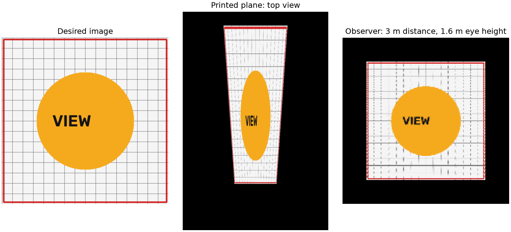

# 관찰 거리·눈높이 기반 평면 아나모픽 이미지 생성 연구

작성일: 2026-10-08 (한국시간). 상태: 선행연구 초기 조사 + 합성 기초 실험 완료. 실제 촬영 실험 미실시. Notion 업로드 미완료.

## 연구 목표

관찰자가 바닥 평면의 지정 영역에서 수평거리 d만큼 떨어져 있고 눈높이가 h일 때, 그 위치에서 원하는 비율의 그림이 보이도록 바닥 이미지를 사전 변형한다. 탑뷰에서는 길고 비대칭인 그림이, 관찰 위치에서는 원하는 그림이 보인다.

사용자가 확정한 범위는 벽·바닥·종이 같은 평면이다. 이번 초기 구현은 수평 바닥과 단일 관찰자를 다룬다. 일반 벽면으로 확장하려면 평면의 좌표계와 방향을 바꾸어야 한다.

그림: 합성 예시. 평면 2×3 m, 거리 3 m, 눈높이 1.6 m. 관찰 영상은 가독성을 위해 확대했으며 탑뷰와 같은 축척이 아니다. 실제 인쇄·촬영 사진이 아니다.

## 가장 중요한 선행연구 결론

- Hunt, Nickel, Gigault, **Anamorphic images** (2000): 유한한 거리와 높이를 포함하는 평면 아나모픽 변환을 이미 다룬다.
- Solina, Batagelj, **Dynamic anamorphosis** (2007): 관찰자의 3차원 위치를 추적하고 평면 호모그래피를 갱신하는 동적 보정을 설명한다.
- Van Mai Nguyen Thi, **Development and Optimization of a Two-View Model for Anamorphic Projections on Planar Surfaces** (2015, 학부 졸업연구): 단일·복수 시점의 평면 보정과 최소제곱 최적화를 다룬다.

따라서 거리·눈높이 입력, 호모그래피 역변환, 두 시점 미리보기 자체를 새로운 학술 기여라고 주장하면 안 된다. 연구 기여 후보는 설치 측정 오차의 전파, 제한된 출력 영역과 해상도에서의 품질, 인쇄/촬영으로 확인한 허용 관찰 범위다. 이 후보의 신규성도 추가 조사 전에는 확정할 수 없다.

## 완료한 작업

| 항목 | 상태 |
|---|---|
| 기하 모델 | 거리·높이·측면 위치·시선 방향을 갖는 핀홀 카메라 |
| 비교 실험 | 무보정 / 네 꼭짓점 최소제곱 아핀 / 정확한 투영 보정 |
| 조건 | 거리 4종 × 높이 3종 × 방법 3종, 각 441점 |
| 관찰자 이동 | 245조건, 고정된 출력 이미지 평가 |
| 입력 측정 오차 | 가정된 독립 정규분포로 1,000표본 |
| 별도 수식 검증 | 광선-평면 교차와 역호모그래피 일치 확인 |
| 실제 출력·촬영 | 아직 수행하지 않음 |
| 최신 문헌의 체계적 검색 | 학술 도메인 접근 제한으로 미완료 |
| Notion 기록 | 가져오기 문서 준비 완료, 원격 쓰기는 미완료 |

## 초기 결과 요약

12개 거리·높이 조건에서의 평균 점 RMSE는 무보정 63.607 px, 아핀 14.766 px, 정확한 투영 보정 약 3.04×10^-13 px다. 마지막 값은 동일한 이상적 기하를 알고 있을 때의 수치적 일치이며, 실제 정확도나 새로운 알고리즘의 우수성을 입증하지 않는다.

가정된 측정 오차(거리 표준편차 5 cm, 높이 3 cm, 측면 위치 2 cm)에서 RMSE 중앙값은 0.841 px, 95백분위는 1.859 px다. 이는 선택한 가상 카메라·그림 크기·오차분포에 한정된다. 실제 사용자의 측정 정확도나 지각 허용치를 측정한 결과가 아니다.

## 문서 구성

- [선행연구와 검증 상태](01_선행연구.md)
- [수학 모델과 평가 정의](02_방법과_실험설계.md)
- [실험 기록과 결과](03_실험결과.md)
- [논문 초안](04_논문초안.md)
- [후속 실험 및 작업 목록](05_후속실험.md)

참고 Notion 대상: https://app.notion.com/p/Image-Homography-3f3e5ab1122c8048a7afc1ed2a74b266

현재 파일은 GitHub에서 관리하는 연구 기록이다. 페이지 URL을 알고 있는 것과 Notion에 쓰기 권한이 있는 것은 별개다.
