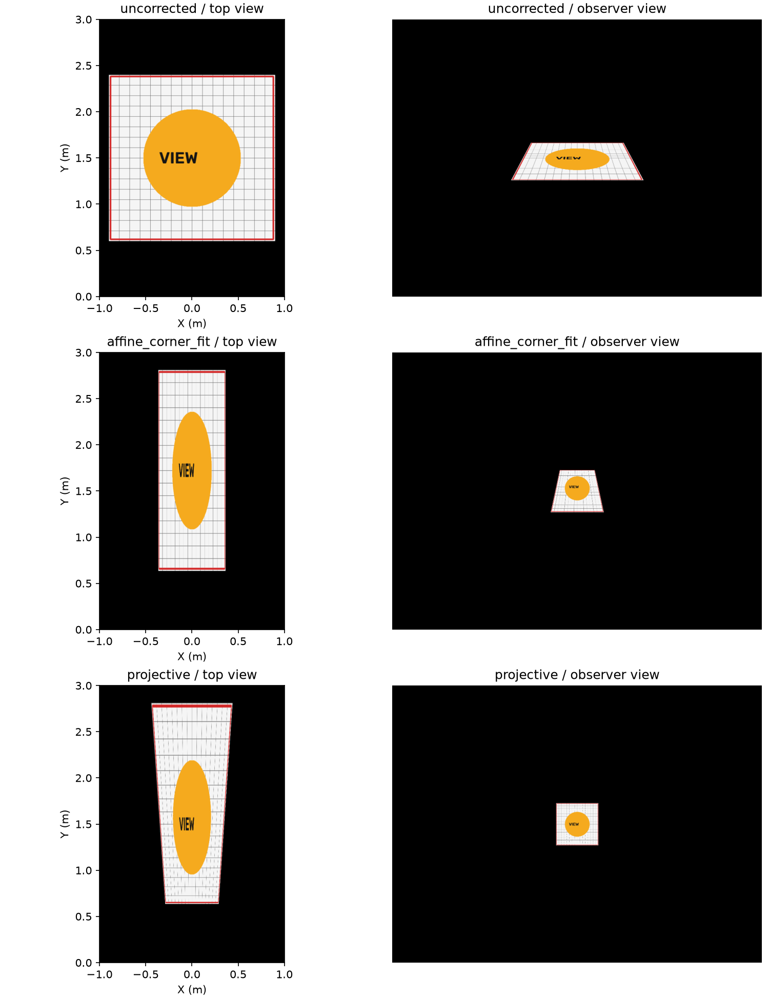
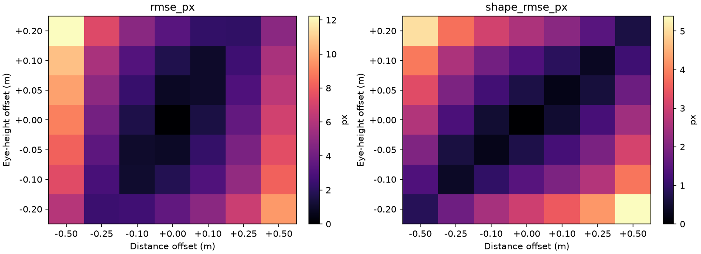

# 실험 기록 — PILOT-002

실행일: 2026-10-08 (한국시간). **합성 실험**이며 실제 카메라 촬영, 사용자 실험, 학습 모델 평가가 아니다. 코드·원시 CSV·실행 환경은 함께 보관했다.

## 설정

- 평면 2×3 m, 가상 영상 1024×768 px, 초점거리 800 px.
- 출력 텍스처 600×900 px, 원본 합성 그림 512×512 px.
- 기준 눈 위치: 거리 3 m, 높이 1.6 m, 측면 0 m. 평면 중앙을 바라본다.
- 기준 목표 그림 한 변: 약 116.915 px. 이보다 높은 실제 센서 해상도를 가정한 결과로 해석하면 안 된다.
- 모든 방법과 실험에서 동일한 좌표 및 지표 정의를 사용했다.

## 1. 이상적 기하에서의 비교

각 방법의 12개 거리·높이 조건을 동일 가중치로 평균했다. 조건별 목표 사각형 크기는 다르다.

| 방법 | 평균 점 RMSE (px) | 평균 형상 RMSE (px) | 평균 대각선 정규화 RMSE |
|---|---:|---:|---:|
| 무보정 | 63.607 | 25.364 | 37.16% |
| 꼭짓점 아핀 적합 | 14.766 | 9.110 | 6.35% |
| 정확한 투영 보정 | 약 3.04×10^-13 | 약 3.58×10^-13 | 수치 정밀도 수준 |

해석: 완전한 원근 변환을 가진 장면에서 아핀 변환은 잔여 오차를 갖는다. 정확한 투영 보정의 0에 가까운 값은 참 카메라 모델을 생성과 평가에 사용했기 때문에 예상되는 결과다. 실제 상황의 정확도, 추정기 성능 또는 신규성을 주장하는 근거가 아니다. 무보정은 다른 방법과 목표 각크기가 다르므로 원시 오차만으로 공정한 알고리즘 순위를 주장하지 않는다.

모든 격자의 바닥 범위 포함을 검사했다. 이 설정에서는 세 방법 모두 범위 밖 비율이 0이었다. 이는 다른 영역 크기나 시점에서도 성립한다는 보장이 아니다.



## 2. 유한 해상도에서의 관찰 영상 품질

기준 거리 3 m·높이 1.6 m, 동일 합성 그림 한 장, 목표 내부 12,769픽셀에 대한 결과다.

| 방법 | RGB MSE (0–255 척도) | PSNR (dB) |
|---|---:|---:|
| 무보정 | 11615.691 | 7.480 |
| 꼭짓점 아핀 적합 | 4157.890 | 11.942 |
| 정확한 투영 보정 | 175.438 | 25.690 |

정확한 기하에서도 두 단계의 보간과 해상도 손실이 남는다. 배경의 검은 영역을 대량 포함해서 PSNR을 부풀리지 않도록 목표 내부 마스크에서 계산했다. 이 결과는 한 합성 그림의 진단값으로, 일반 이미지 품질 평가를 대체하지 않는다.

## 3. 출력물을 고정한 상태에서 관찰자 이동

기준 d=3 m,h=1.6 m 출력물을 고정했다. 시선은 이동 후에도 평면 중앙으로 재정렬한다.

| 변화 | 점 RMSE (px) | 형상 RMSE (px) |
|---|---:|---:|
| 거리 -0.5 m | 9.019 | 2.634 |
| 거리 +0.5 m | 6.899 | 2.409 |
| 높이 -0.2 m | 3.624 | 3.004 |
| 높이 +0.2 m | 3.321 | 2.581 |
| 측면 ±0.3 m | 7.066 | 4.386 |

245조건 전체는 viewpoint_sensitivity.csv에 저장했다. 형상 RMSE와 원시 RMSE의 차이는 거리 변화가 그림의 각크기도 바꾸기 때문이다. 2 px 등을 실제 지각 허용치로 선정한 적은 없으므로 “이 범위에서 착시가 유지된다”는 사용자 경험 주장을 하지 않는다.



기준 위치에서 ±1 cm 중앙차분으로 얻은 국소 민감도는 거리 15.667 px/m, 높이 17.367 px/m, 측면 23.634 px/m다. 이는 해당 위치·시선 재정렬·카메라·목표 크기에서의 값이며 전 범위 일반 순위가 아니다.

## 4. 생성기에 입력하는 거리·높이의 측정 오차

실제 위치는 기준값에 고정했다. 독립 정규분포 σ_d=5 cm, σ_h=3 cm, σ_x=2 cm를 가정하고 1,000개의 입력값과 출력 이미지를 모사했다.

| 지표 | 중앙값 | 95백분위 |
|---|---:|---:|
| 점 RMSE | 0.841 px | 1.859 px |
| 형상 RMSE | 0.456 px | 1.024 px |

95백분위는 신뢰구간이 아니다. 오차분포는 사용자 측정에서 추정한 값이 아니다. 출력 범위 밖 격자가 발생한 표본은 이번 1,000개 중 0개였다.

## 5. 검증 및 재현

- 별도 3차원 카메라 투영과 평면 호모그래피의 일치를 검사했다.
- 광선-평면 교차로 구한 물리적 좌표와 inverse(G)의 최대 차이는 약 1.67×10^-15 m다.
- 회전행렬의 직교성·오른손 좌표계, 카메라 앞쪽 깊이, 투영 분모, 평면 범위에 assertion을 사용했다.
- PILOT-001과 PILOT-002의 네 원시 수치 CSV가 바이트 단위로 동일함을 확인했다. PILOT-002에는 별도 교차 검증과 설명 그림 생성이 코드에 포함되었다.
- 이전 환경 설치 검증의 0.14 px RANSAC 결과는 다른 합성 대응점 실험이다. 본 연구의 정확한 기하 결과와 섞지 않는다.

실행 명령:

```bash
source .venv/bin/activate
python research/experiment.py \
  --output research/results/local-pilot
```

출력 디렉터리가 비어 있지 않으면 덮어쓰지 않고 실패한다. 저장소 루트에서 research/README.md의 설치 절차를 먼저 실행한다. research/requirements.lock에는 검증된 환경의 전체 의존성 버전이 고정되어 있다.

재현용 파일: experiment.py, requirements.lock, summary.json, baseline.csv, render_quality.csv, viewpoint_sensitivity.csv, measurement_error_monte_carlo.csv. summary.json에 코드 SHA-256·패키지 버전·seed·실행 시간이 있다.

## 한계

평면의 기울기 오차, 프린터 비등방 확대, 렌즈 왜곡, 화면 광학, 사람의 양안시·지각, 움직임 지연, 조명 및 바닥 반사율은 포함하지 않았다. 임의의 이미지·종횡비·영역에 대해 실험하지 않았다. 반복 촬영이나 통계적 유의성 검정을 수행하지 않았다. 이는 본 실험에서 테스트가 실패했다는 뜻이 아니라 아직 실행하지 않은 범위다.
